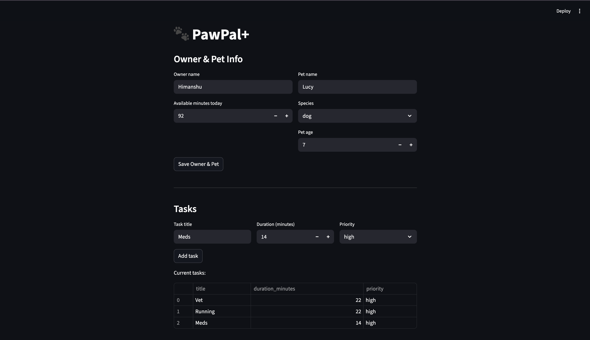

# PawPal+ (Module 2 Project)

You are building **PawPal+**, a Streamlit app that helps a pet owner plan care tasks for their pet.

## Demo



---

## Scenario

A busy pet owner needs help staying consistent with pet care. They want an assistant that can:

- Track pet care tasks (walks, feeding, meds, enrichment, grooming, etc.)
- Consider constraints (time available, priority, owner preferences)
- Produce a daily plan and explain why it chose that plan

Your job is to design the system first (UML), then implement the logic in Python, then connect it to the Streamlit UI.

## What you will build

Your final app should:

- Let a user enter basic owner + pet info
- Let a user add/edit tasks (duration + priority at minimum)
- Generate a daily schedule/plan based on constraints and priorities
- Display the plan clearly (and ideally explain the reasoning)
- Include tests for the most important scheduling behaviors

## Features

### Priority-based scheduling
The scheduler collects all incomplete tasks across every registered pet and sorts them by priority (`high → medium → low`) before fitting them into the owner's available time budget. Tasks are greedily accepted in priority order; any task whose duration would exceed the remaining time is skipped entirely. This guarantees that the highest-value care actions are always performed first when time is limited.

### Sorting by time
`sort_by_time()` reorders the scheduled task list by each task's `"HH:MM"` start time using numeric comparison, so `"9:00"` correctly precedes `"10:00"` (lexicographic sorting would get this wrong). Tasks with no start time assigned are moved to the end of the list, preserving a clean chronological view of the day.

### Task filtering
`filter_tasks(pet_name, completed)` returns a subset of the scheduled task list in a single pass. Both parameters are optional and composable: you can filter by pet name only, by completion status only, or by both simultaneously. Passing neither argument returns all scheduled tasks unchanged.

### Recurring tasks
Tasks support a `recurrence` field with three modes: `"none"`, `"daily"`, and `"weekly"`. When `mark_complete()` is called on a recurring task, it marks the current instance as done and returns a **new** `Task` object with `due_date` set to the next occurrence (`today + 1 day` for daily, `today + 7 days` for weekly). Non-recurring tasks return `None`. The caller is responsible for adding the new task back to the pet, keeping recurrence logic out of the `Task` class itself.

### Conflict detection
`detect_conflicts()` scans all scheduled tasks that have a start time set and identifies every pair sharing the same `"HH:MM"` value. It returns a list of human-readable warning strings (one per conflicting pair) describing the time slot and both task names. The method is purely read-only: it never raises an exception, never modifies scheduler state, and returns an empty list when no conflicts exist.

### Conflict warnings in the UI
After generating a schedule, the Streamlit interface calls `detect_conflicts()` and surfaces results in two layers: a prominent `st.error` banner with the total conflict count, and a collapsible expander showing each individual conflict. The schedule table includes a `Status` column that marks conflicting tasks as `"CONFLICT"` and safe tasks as `"OK"`, so a pet owner can identify exactly which task needs to be rescheduled without reading through a separate report.

### Task management per pet
Each `Pet` maintains its own task list. Tasks can be added (`add_task`), removed by ID (`remove_task`), and edited in-place (`Task.edit`). The `Owner` object aggregates all pets, giving the `Scheduler` a single entry point to collect tasks across a multi-pet household.

---

## Smarter Scheduling

The `Scheduler` class has been extended with four features beyond basic priority-based scheduling:

**Sorting by time**: `sort_by_time()` reorders `scheduled_tasks` by their `"HH:MM"` start time using numeric comparison, so `"9:00"` correctly sorts before `"10:00"`. Tasks with no time set are moved to the end.

**Filtering**: `filter_tasks(pet_name, completed)` returns a subset of scheduled tasks in a single pass. Both parameters are optional and can be combined, e.g. incomplete tasks for a specific pet only.

**Recurring tasks**: `Task` now supports a `recurrence` field (`"none"`, `"daily"`, `"weekly"`). When `mark_complete()` is called on a recurring task, it returns a new `Task` instance with `due_date` set to the next occurrence via `timedelta`, which the caller can add back to the pet.

**Conflict detection**: `detect_conflicts()` checks all scheduled tasks with a time set and returns a list of human-readable warning strings for any two tasks sharing the same start time. It never raises an exception or modifies state.

---

## Testing PawPal+

### Run the test suite

```bash
python -m pytest tests/test_pawpal.py -v
```

### What the tests cover

29 tests across 6 categories:

| Category | Tests | What's verified |
|---|---|---|
| **Sorting** | 4 | Tasks return in chronological HH:MM order; untimed tasks sort to the end; all-untimed list doesn't crash |
| **Recurrence** | 5 | Daily task completion creates a new task due tomorrow; weekly creates one due in 7 days; non-recurring returns `None`; new task preserves all fields and starts incomplete |
| **Conflict detection** | 5 | Same-time tasks produce a warning; 3 tasks at the same time produce 3 pair-wise warnings; unique times produce no warnings; `time=""` tasks are never flagged; scheduler state is never mutated |
| **Schedule generation** | 6 | Tasks fitting exactly within the time budget are included; tasks 1 minute over are excluded; completed tasks are skipped; output order is high → medium → low; zero-minute budget yields empty schedule; tasks from multiple pets are all collected |
| **Filtering** | 5 | Filter by pet name, by completion status, both combined, neither (returns all), and a nonexistent pet name (returns empty list) |
| **Pet task removal** | 2 | `remove_task()` removes only the matching ID; removing a nonexistent ID leaves the list unchanged |

### Confidence Level

**4 / 5 stars**

All 29 tests pass. Core scheduling logic (priority ordering, time budget, conflict detection, recurrence chaining) is thoroughly verified. One star is withheld because the conflict detection uses start-time matching only: two tasks at `"07:00"` of different durations are flagged as conflicting even if they would not actually overlap, and the Streamlit UI has no tests at all.

---

## Getting started

### Setup

```bash
python -m venv .venv
source .venv/bin/activate  # Windows: .venv\Scripts\activate
pip install -r requirements.txt
```

### Suggested workflow

1. Read the scenario carefully and identify requirements and edge cases.
2. Draft a UML diagram (classes, attributes, methods, relationships).
3. Convert UML into Python class stubs (no logic yet).
4. Implement scheduling logic in small increments.
5. Add tests to verify key behaviors.
6. Connect your logic to the Streamlit UI in `app.py`.
7. Refine UML so it matches what you actually built.
